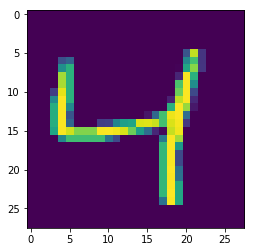
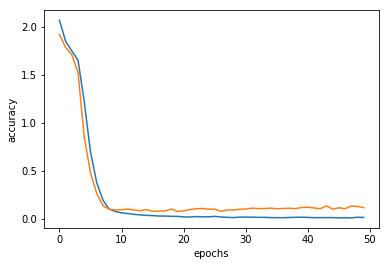

```python
import keras
import numpy as np
from keras.models import Sequential
from keras.layers import Input,Dense,Activation,Flatten,Dropout
from keras.layers import Conv2D,Conv1D,Conv3D,MaxPool2D
fashion_mnist = keras.datasets.fashion_mnist
digit_minst = keras.datasets.mnist
import matplotlib.pyplot as plt
```


```python
(train_images, train_labels), (test_images, test_labels) = digit_minst.load_data()
plt.imshow(train_images[2])
toto_images = test_images
```





```python
train_images.shape
```


    (60000, 28, 28)


```python
model = Sequential()

model.add(Conv2D(16,kernel_size=5,activation="relu",input_shape=(28,28,1)))
model.add(MaxPool2D())

model.add(Conv2D(32,kernel_size=5,activation="relu"))
model.add(MaxPool2D())

model.add(Conv2D(64,kernel_size=2,activation="relu"))
model.add(MaxPool2D())

model.add(Flatten())
model.add(Dense(10,activation="relu"))
model.add(Dense(10,activation= "softmax"))

model.compile(optimizer="adam",loss = "sparse_categorical_crossentropy",metrics= ["accuracy"])
model.summary()
    
```

    _________________________________________________________________
    Layer (type)                 Output Shape              Param #   
    =================================================================
    conv2d_37 (Conv2D)           (None, 24, 24, 16)        416       
    _________________________________________________________________
    max_pooling2d_30 (MaxPooling (None, 12, 12, 16)        0         
    _________________________________________________________________
    conv2d_38 (Conv2D)           (None, 8, 8, 32)          12832     
    _________________________________________________________________
    max_pooling2d_31 (MaxPooling (None, 4, 4, 32)          0         
    _________________________________________________________________
    conv2d_39 (Conv2D)           (None, 3, 3, 64)          8256      
    _________________________________________________________________
    max_pooling2d_32 (MaxPooling (None, 1, 1, 64)          0         
    _________________________________________________________________
    flatten_5 (Flatten)          (None, 64)                0         
    _________________________________________________________________
    dense_9 (Dense)              (None, 10)                650       
    _________________________________________________________________
    dense_10 (Dense)             (None, 10)                110       
    =================================================================
    Total params: 22,264
    Trainable params: 22,264
    Non-trainable params: 0
    _________________________________________________________________


```python
train_images = train_images.reshape(train_images.shape[0],28,28,1)
```


```python
test_images = test_images.reshape(test_images.shape[0],28,28,1)
```


```python
history = model.fit(train_images,train_labels ,validation_data=(test_images,test_labels), epochs=50 , batch_size= 280 , verbose = 2)
```

    Train on 60000 samples, validate on 10000 samples
    Epoch 1/50
     - 14s - loss: 2.0670 - acc: 0.1986 - val_loss: 1.9196 - val_acc: 0.2226
    Epoch 2/50
     - 13s - loss: 1.8475 - acc: 0.2255 - val_loss: 1.7825 - val_acc: 0.2420
    Epoch 3/50
     - 13s - loss: 1.7470 - acc: 0.2400 - val_loss: 1.7078 - val_acc: 0.2510
    Epoch 4/50
     - 13s - loss: 1.6509 - acc: 0.2877 - val_loss: 1.5215 - val_acc: 0.4088
    Epoch 5/50
     - 14s - loss: 1.2179 - acc: 0.5146 - val_loss: 0.8468 - val_acc: 0.6850
    Epoch 6/50
     - 14s - loss: 0.6959 - acc: 0.7586 - val_loss: 0.4782 - val_acc: 0.8883
    Epoch 7/50
     - 13s - loss: 0.3768 - acc: 0.9230 - val_loss: 0.2659 - val_acc: 0.9600
    Epoch 8/50
     - 13s - loss: 0.1948 - acc: 0.9618 - val_loss: 0.1363 - val_acc: 0.9657
    Epoch 9/50
     - 13s - loss: 0.0999 - acc: 0.9737 - val_loss: 0.0999 - val_acc: 0.9748
    Epoch 10/50
     - 13s - loss: 0.0755 - acc: 0.9797 - val_loss: 0.0916 - val_acc: 0.9760
    Epoch 11/50
     - 13s - loss: 0.0610 - acc: 0.9835 - val_loss: 0.0938 - val_acc: 0.9746
    Epoch 12/50
     - 13s - loss: 0.0541 - acc: 0.9851 - val_loss: 0.1008 - val_acc: 0.9746
    Epoch 13/50
     - 13s - loss: 0.0453 - acc: 0.9877 - val_loss: 0.0913 - val_acc: 0.9780
    Epoch 14/50
     - 13s - loss: 0.0399 - acc: 0.9885 - val_loss: 0.0831 - val_acc: 0.9789
    Epoch 15/50
     - 14s - loss: 0.0348 - acc: 0.9901 - val_loss: 0.0952 - val_acc: 0.9757
    Epoch 16/50
     - 14s - loss: 0.0330 - acc: 0.9905 - val_loss: 0.0765 - val_acc: 0.9805
    Epoch 17/50
     - 13s - loss: 0.0281 - acc: 0.9916 - val_loss: 0.0793 - val_acc: 0.9821
    Epoch 18/50
     - 13s - loss: 0.0275 - acc: 0.9922 - val_loss: 0.0806 - val_acc: 0.9834
    Epoch 19/50
     - 13s - loss: 0.0251 - acc: 0.9922 - val_loss: 0.1005 - val_acc: 0.9770
    Epoch 20/50
     - 13s - loss: 0.0244 - acc: 0.9932 - val_loss: 0.0763 - val_acc: 0.9836
    Epoch 21/50
     - 13s - loss: 0.0190 - acc: 0.9942 - val_loss: 0.0813 - val_acc: 0.9829
    Epoch 22/50
     - 13s - loss: 0.0176 - acc: 0.9951 - val_loss: 0.0955 - val_acc: 0.9804
    Epoch 23/50
     - 13s - loss: 0.0223 - acc: 0.9931 - val_loss: 0.1033 - val_acc: 0.9787
    Epoch 24/50
     - 13s - loss: 0.0194 - acc: 0.9941 - val_loss: 0.1069 - val_acc: 0.9800
    Epoch 25/50
     - 13s - loss: 0.0202 - acc: 0.9937 - val_loss: 0.0982 - val_acc: 0.9816
    Epoch 26/50
     - 13s - loss: 0.0244 - acc: 0.9924 - val_loss: 0.0999 - val_acc: 0.9801
    Epoch 27/50
     - 13s - loss: 0.0184 - acc: 0.9950 - val_loss: 0.0768 - val_acc: 0.9848
    Epoch 28/50
     - 13s - loss: 0.0144 - acc: 0.9958 - val_loss: 0.0906 - val_acc: 0.9822
    Epoch 29/50
     - 13s - loss: 0.0118 - acc: 0.9967 - val_loss: 0.0900 - val_acc: 0.9836
    Epoch 30/50
     - 13s - loss: 0.0170 - acc: 0.9945 - val_loss: 0.0989 - val_acc: 0.9811
    Epoch 31/50
     - 13s - loss: 0.0165 - acc: 0.9952 - val_loss: 0.1001 - val_acc: 0.9819
    Epoch 32/50
     - 13s - loss: 0.0164 - acc: 0.9954 - val_loss: 0.1099 - val_acc: 0.9784
    Epoch 33/50
     - 14s - loss: 0.0139 - acc: 0.9957 - val_loss: 0.1056 - val_acc: 0.9817
    Epoch 34/50
     - 13s - loss: 0.0151 - acc: 0.9954 - val_loss: 0.1057 - val_acc: 0.9809
    Epoch 35/50
     - 13s - loss: 0.0113 - acc: 0.9965 - val_loss: 0.1100 - val_acc: 0.9810
    Epoch 36/50
     - 13s - loss: 0.0111 - acc: 0.9967 - val_loss: 0.1038 - val_acc: 0.9808
    Epoch 37/50
     - 13s - loss: 0.0104 - acc: 0.9971 - val_loss: 0.1064 - val_acc: 0.9834
    Epoch 38/50
     - 13s - loss: 0.0127 - acc: 0.9960 - val_loss: 0.1089 - val_acc: 0.9823
    Epoch 39/50
     - 14s - loss: 0.0150 - acc: 0.9958 - val_loss: 0.1048 - val_acc: 0.9831
    Epoch 40/50
     - 14s - loss: 0.0159 - acc: 0.9952 - val_loss: 0.1170 - val_acc: 0.9803
    Epoch 41/50
     - 14s - loss: 0.0138 - acc: 0.9960 - val_loss: 0.1201 - val_acc: 0.9785
    Epoch 42/50
     - 14s - loss: 0.0103 - acc: 0.9969 - val_loss: 0.1121 - val_acc: 0.9819
    Epoch 43/50
     - 13s - loss: 0.0119 - acc: 0.9968 - val_loss: 0.1041 - val_acc: 0.9826
    Epoch 44/50
     - 13s - loss: 0.0115 - acc: 0.9968 - val_loss: 0.1336 - val_acc: 0.9792
    Epoch 45/50
     - 13s - loss: 0.0116 - acc: 0.9968 - val_loss: 0.0989 - val_acc: 0.9835
    Epoch 46/50
     - 14s - loss: 0.0090 - acc: 0.9976 - val_loss: 0.1141 - val_acc: 0.9811
    Epoch 47/50
     - 13s - loss: 0.0102 - acc: 0.9971 - val_loss: 0.1044 - val_acc: 0.9831
    Epoch 48/50
     - 14s - loss: 0.0084 - acc: 0.9978 - val_loss: 0.1332 - val_acc: 0.9786
    Epoch 49/50
     - 14s - loss: 0.0159 - acc: 0.9954 - val_loss: 0.1269 - val_acc: 0.9777
    Epoch 50/50
     - 14s - loss: 0.0132 - acc: 0.9961 - val_loss: 0.1155 - val_acc: 0.9828


```python
plt.plot(history.history["acc"])
plt.plot(history.history["val_acc"])
plt.xlabel("epochs")
plt.ylabel("accuracy")
plt.show()
```


```python
plt.plot(history.history["loss"])
plt.plot(history.history["val_loss"])
plt.xlabel("epochs")
plt.ylabel("accuracy")
plt.show()
```





```python
predict = model.predict(test_images)
```


```python
predict[0]
```


    array([2.0868085e-14, 4.3646593e-05, 4.4887738e-06, 2.8989874e-18,
           5.6717390e-08, 7.1617545e-23, 1.4478401e-15, 9.9995184e-01,
           1.6486633e-12, 6.1014521e-22], dtype=float32)


```python
def plot_image(i,prediction_array,true_label,img):
    prediction_array,true_label,img = predict[i],test_labels[i],toto_images[i]
    plt.grid("False")
    plt.xticks([])
    plt.yticks([])
    plt.imshow(img,cmap=plt.cm.binary)
    predict_label = np.argmax(prediction_array)
    if(predict_label == true_label):
        color = "Blue"
    else:
        color = "red"
        
    plt.xlabel("{} {} ({})".format(predict_label,
                                       100*np.max(prediction_array),
                                       true_label,color=color))
    

```


```python
i = 0 
plt.figure(figsize=(10,5))
plt.subplot(1,2,1)
plot_image(i,predict,test_labels,test_images)
plt.show()
```


```python
def plot_value_array(i, predictions_array, true_label):
  predictions_array, true_label = predictions_array[i], true_label[i]
  plt.grid(False)
  plt.xticks([])
  plt.yticks([])
  thisplot = plt.bar(range(10), predictions_array, color="#777777")
  plt.ylim([0, 1])
  predicted_label = np.argmax(predictions_array)
  plt.xticks(range(10), [0,1,2,3,4,5,6,7,8,9], rotation=45)
  thisplot[predicted_label].set_color('red')
  thisplot[true_label].set_color('blue')
```


```python
i = 1054
plt.figure(figsize=(10,5))
plt.subplot(1,2,1)
plot_image(i,predict,test_labels,test_images)
plt.subplot(1,2,2)
plot_value_array(i,predict,test_labels)
plt.show()
```


