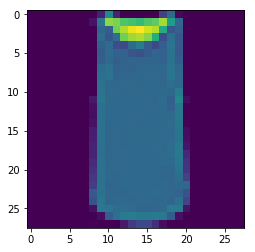
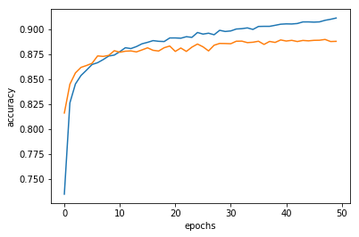
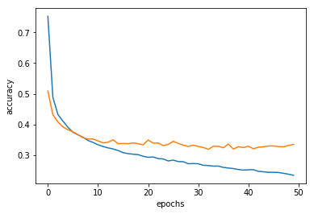
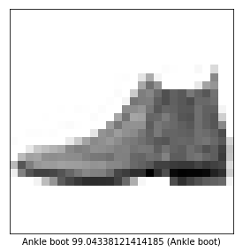
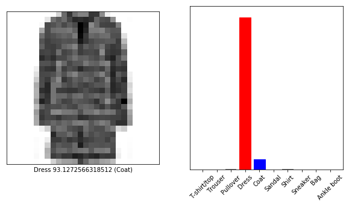

```python
import keras
import matplotlib.pyplot as plt
```


```python
import keras 

fashion_mnist = keras.datasets.fashion_mnist

(train_images, train_labels), (test_images, test_labels) = fashion_mnist.load_data()

toto_images = test_images
```


```python
plt.imshow(train_images[2])
```


    <matplotlib.image.AxesImage at 0x7f0053254be0>





```python
class_names = ['T-shirt/top', 'Trouser', 'Pullover', 'Dress', 'Coat',
               'Sandal', 'Shirt', 'Sneaker', 'Bag', 'Ankle boot']
```


```python
train_images = train_images/255
test_images = test_images/255
```


```python
plt.figure(figsize=(10,10))
for i in range(25):
    plt.subplot(5,5,i+1)
    #plt.grid(False)
    plt.xticks([])
    plt.yticks([])
    plt.imshow(train_images[i],cmap=plt.cm.binary)
    plt.xlabel(class_names[train_labels[i]])
plt.show()
```


```python
vector_len = train_images[0].shape[0]*train_images[0].shape[0]
print(train_images[0].shape[0])
```

    28


```python
train_images = train_images.reshape(train_images.shape[0],vector_len)
test_images = test_images.reshape(test_images.shape[0],vector_len)
train_images.shape
```


    (60000, 784)


```python
train_labels[0]
```


    9


```python
from keras.models import Sequential
from keras.layers import Dense,Activation,Dropout

model = Sequential()
model.add(Dense(128,input_dim = 28*28 , activation ="relu"))
model.add(Dropout(0.4))
model.add(Dense(64,activation="relu"))
model.add(Dense(10,activation = "softmax"))

model.compile(optimizer="adam",loss = "sparse_categorical_crossentropy",metrics= ["accuracy"])
model.summary()
```

    _________________________________________________________________
    Layer (type)                 Output Shape              Param #   
    =================================================================
    dense_43 (Dense)             (None, 128)               100480    
    _________________________________________________________________
    dropout_11 (Dropout)         (None, 128)               0         
    _________________________________________________________________
    dense_44 (Dense)             (None, 64)                8256      
    _________________________________________________________________
    dense_45 (Dense)             (None, 10)                650       
    =================================================================
    Total params: 109,386
    Trainable params: 109,386
    Non-trainable params: 0
    _________________________________________________________________


```python
history = model.fit(train_images,train_labels ,validation_data=(test_images,test_labels), epochs=50 , batch_size= 280 , verbose = 2)
```

    Train on 60000 samples, validate on 10000 samples
    Epoch 1/50
     - 2s - loss: 0.7528 - acc: 0.7347 - val_loss: 0.5090 - val_acc: 0.8160
    Epoch 2/50
     - 1s - loss: 0.4882 - acc: 0.8262 - val_loss: 0.4314 - val_acc: 0.8448
    Epoch 3/50
     - 1s - loss: 0.4323 - acc: 0.8451 - val_loss: 0.4079 - val_acc: 0.8562
    Epoch 4/50
     - 1s - loss: 0.4109 - acc: 0.8536 - val_loss: 0.3917 - val_acc: 0.8617
    Epoch 5/50
     - 1s - loss: 0.3905 - acc: 0.8589 - val_loss: 0.3825 - val_acc: 0.8636
    Epoch 6/50
     - 1s - loss: 0.3744 - acc: 0.8646 - val_loss: 0.3759 - val_acc: 0.8658
    Epoch 7/50
     - 1s - loss: 0.3660 - acc: 0.8664 - val_loss: 0.3661 - val_acc: 0.8732
    Epoch 8/50
     - 1s - loss: 0.3582 - acc: 0.8695 - val_loss: 0.3563 - val_acc: 0.8727
    Epoch 9/50
     - 1s - loss: 0.3475 - acc: 0.8731 - val_loss: 0.3524 - val_acc: 0.8737
    Epoch 10/50
     - 1s - loss: 0.3411 - acc: 0.8740 - val_loss: 0.3521 - val_acc: 0.8784
    Epoch 11/50
     - 1s - loss: 0.3335 - acc: 0.8774 - val_loss: 0.3461 - val_acc: 0.8769
    Epoch 12/50
     - 1s - loss: 0.3277 - acc: 0.8814 - val_loss: 0.3397 - val_acc: 0.8779
    Epoch 13/50
     - 1s - loss: 0.3233 - acc: 0.8806 - val_loss: 0.3416 - val_acc: 0.8782
    Epoch 14/50
     - 1s - loss: 0.3198 - acc: 0.8826 - val_loss: 0.3497 - val_acc: 0.8772
    Epoch 15/50
     - 1s - loss: 0.3146 - acc: 0.8853 - val_loss: 0.3370 - val_acc: 0.8792
    Epoch 16/50
     - 1s - loss: 0.3077 - acc: 0.8868 - val_loss: 0.3375 - val_acc: 0.8813
    Epoch 17/50
     - 1s - loss: 0.3045 - acc: 0.8885 - val_loss: 0.3370 - val_acc: 0.8788
    Epoch 18/50
     - 1s - loss: 0.3026 - acc: 0.8878 - val_loss: 0.3395 - val_acc: 0.8781
    Epoch 19/50
     - 1s - loss: 0.3012 - acc: 0.8876 - val_loss: 0.3370 - val_acc: 0.8814
    Epoch 20/50
     - 1s - loss: 0.2958 - acc: 0.8912 - val_loss: 0.3333 - val_acc: 0.8831
    Epoch 21/50
     - 1s - loss: 0.2924 - acc: 0.8912 - val_loss: 0.3490 - val_acc: 0.8777
    Epoch 22/50
     - 1s - loss: 0.2935 - acc: 0.8909 - val_loss: 0.3387 - val_acc: 0.8811
    Epoch 23/50
     - 1s - loss: 0.2883 - acc: 0.8924 - val_loss: 0.3390 - val_acc: 0.8777
    Epoch 24/50
     - 1s - loss: 0.2870 - acc: 0.8918 - val_loss: 0.3309 - val_acc: 0.8820
    Epoch 25/50
     - 1s - loss: 0.2807 - acc: 0.8966 - val_loss: 0.3342 - val_acc: 0.8851
    Epoch 26/50
     - 1s - loss: 0.2832 - acc: 0.8950 - val_loss: 0.3448 - val_acc: 0.8823
    Epoch 27/50
     - 1s - loss: 0.2787 - acc: 0.8959 - val_loss: 0.3380 - val_acc: 0.8782
    Epoch 28/50
     - 1s - loss: 0.2781 - acc: 0.8944 - val_loss: 0.3320 - val_acc: 0.8839
    Epoch 29/50
     - 1s - loss: 0.2715 - acc: 0.8989 - val_loss: 0.3281 - val_acc: 0.8857
    Epoch 30/50
     - 1s - loss: 0.2721 - acc: 0.8977 - val_loss: 0.3321 - val_acc: 0.8856
    Epoch 31/50
     - 1s - loss: 0.2715 - acc: 0.8982 - val_loss: 0.3281 - val_acc: 0.8854
    Epoch 32/50
     - 1s - loss: 0.2665 - acc: 0.9001 - val_loss: 0.3245 - val_acc: 0.8879
    Epoch 33/50
     - 1s - loss: 0.2657 - acc: 0.9005 - val_loss: 0.3184 - val_acc: 0.8880
    Epoch 34/50
     - 1s - loss: 0.2637 - acc: 0.9013 - val_loss: 0.3287 - val_acc: 0.8865
    Epoch 35/50
     - 1s - loss: 0.2638 - acc: 0.8997 - val_loss: 0.3284 - val_acc: 0.8869
    Epoch 36/50
     - 1s - loss: 0.2595 - acc: 0.9027 - val_loss: 0.3236 - val_acc: 0.8879
    Epoch 37/50
     - 1s - loss: 0.2575 - acc: 0.9028 - val_loss: 0.3356 - val_acc: 0.8847
    Epoch 38/50
     - 1s - loss: 0.2557 - acc: 0.9028 - val_loss: 0.3194 - val_acc: 0.8877
    Epoch 39/50
     - 1s - loss: 0.2526 - acc: 0.9039 - val_loss: 0.3270 - val_acc: 0.8867
    Epoch 40/50
     - 1s - loss: 0.2508 - acc: 0.9050 - val_loss: 0.3244 - val_acc: 0.8892
    Epoch 41/50
     - 1s - loss: 0.2517 - acc: 0.9053 - val_loss: 0.3286 - val_acc: 0.8881
    Epoch 42/50
     - 1s - loss: 0.2521 - acc: 0.9052 - val_loss: 0.3204 - val_acc: 0.8888
    Epoch 43/50
     - 1s - loss: 0.2466 - acc: 0.9057 - val_loss: 0.3255 - val_acc: 0.8876
    Epoch 44/50
     - 1s - loss: 0.2452 - acc: 0.9072 - val_loss: 0.3268 - val_acc: 0.8887
    Epoch 45/50
     - 1s - loss: 0.2435 - acc: 0.9073 - val_loss: 0.3296 - val_acc: 0.8883
    Epoch 46/50
     - 1s - loss: 0.2436 - acc: 0.9070 - val_loss: 0.3295 - val_acc: 0.8888
    Epoch 47/50
     - 1s - loss: 0.2429 - acc: 0.9073 - val_loss: 0.3274 - val_acc: 0.8889
    Epoch 48/50
     - 1s - loss: 0.2402 - acc: 0.9089 - val_loss: 0.3270 - val_acc: 0.8897
    Epoch 49/50
     - 1s - loss: 0.2374 - acc: 0.9099 - val_loss: 0.3311 - val_acc: 0.8876
    Epoch 50/50
     - 1s - loss: 0.2337 - acc: 0.9111 - val_loss: 0.3347 - val_acc: 0.8878


```python
plt.plot(history.history["acc"])
plt.plot(history.history["val_acc"])
plt.xlabel("epochs")
plt.ylabel("accuracy")
plt.show()
```





```python
plt.plot(history.history["loss"])
plt.plot(history.history["val_loss"])
plt.xlabel("epochs")
plt.ylabel("accuracy")
plt.show()
```





```python
predict = model.predict(test_images)
```


```python
predict[0]
```


    array([5.5832408e-11, 8.7240233e-09, 1.0502517e-10, 8.7749008e-10,
           1.7965299e-10, 1.1733794e-04, 2.1683765e-10, 9.4487751e-03,
           3.8488487e-10, 9.9043381e-01], dtype=float32)


```python
import numpy as np
np.argmax(predict[0])
```


    9


```python
def plot_image(i,prediction_array,true_label,img):
    prediction_array,true_label,img = predict[i],test_labels[i],toto_images[i]
    plt.grid("False")
    plt.xticks([])
    plt.yticks([])
    plt.imshow(img,cmap=plt.cm.binary)
    predict_label = np.argmax(prediction_array)
    if(predict_label == true_label):
        color = "Blue"
    else:
        color = "red"
        
    plt.xlabel("{} {} ({})".format(class_names[predict_label],
                                       100*np.max(prediction_array),
                                       class_names[true_label],color=color))
    

```


```python
i = 0 
plt.figure(figsize=(10,5))
plt.subplot(1,2,1)
plot_image(i,predict,test_labels,test_images)
plt.show()
```





```python
def plot_value_array(i, predictions_array, true_label):
  predictions_array, true_label = predictions_array[i], true_label[i]
  plt.grid(False)
  plt.xticks([])
  plt.yticks([])
  thisplot = plt.bar(range(10), predictions_array, color="#777777")
  plt.ylim([0, 1])
  predicted_label = np.argmax(predictions_array)
  plt.xticks(range(10), class_names, rotation=45)
  thisplot[predicted_label].set_color('red')
  thisplot[true_label].set_color('blue')
```


```python
i = 153
plt.figure(figsize=(10,5))
plt.subplot(1,2,1)
plot_image(i,predict,test_labels,test_images)
plt.subplot(1,2,2)
plot_value_array(i,predict,test_labels)
plt.show()
```




